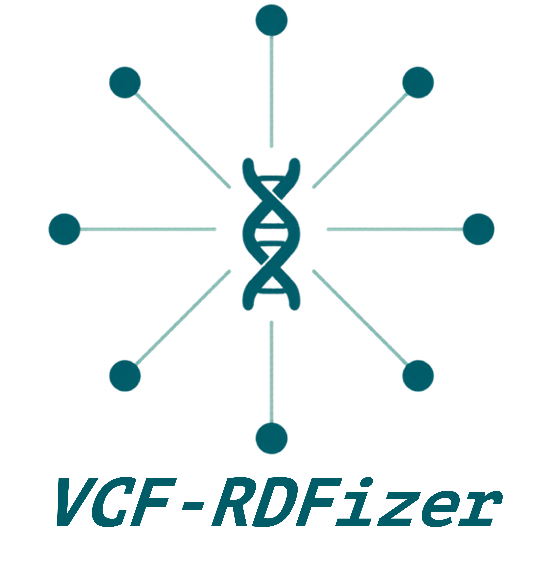

[](https://github.com/ecrum19/VCF-RDFizer/actions/workflows/tests.yml)
[](https://github.com/ecrum19/VCF-RDFizer/actions/workflows/publish-python.yml)
[](https://github.com/ecrum19/VCF-RDFizer/actions/workflows/publish-docker.yml)
[](https://codecov.io/gh/ecrum19/VCF-RDFizer)
[](https://pypi.org/project/vcf-rdfizer/)
[](https://pypi.org/project/vcf-rdfizer/)
[](https://hub.docker.com/r/ecrum19/vcf-rdfizer)
[](https://anaconda.org/conda-forge/vcf-rdfizer)
[](https://github.com/ecrum19/VCF-RDFizer/blob/main/LICENSE)

<p align="center">
  
</p>

VCF-RDFizer is a Docker-first CLI wrapper for:
1. VCF -> RDF (N-Triples) with RMLStreamer
2. Optional RDF compression/decompression

The VCF-RDFizer vocabulary is available at [https://w3id.org/vcf-rdfizer/vocab#](https://w3id.org/vcf-rdfizer/vocab#).

## Requirements

- Python 3.10+
- Docker (installed and running)

Install options:

```bash
pip install vcf-rdfizer
```

or

```bash
pipx install vcf-rdfizer
```

or

```bash
conda install -c conda-forge vcf-rdfizer
```

or pull the prebuilt Docker image directly:

```bash
docker pull ecrum19/vcf-rdfizer:latest
```

Release maintainers: see [`RELEASING.md`](RELEASING.md) for the PyPI,
Docker Hub, and conda-forge release procedure.

## Important CLI Rule

`--out` is required for all modes.

This is the run output root directory. VCF-RDFizer places:
- final RDF/compression outputs
- run metrics/logs
- hidden intermediates

inside this directory.

## Modes

- `full`: VCF -> TSV -> RDF -> compression
- `tsv`: VCF -> TSV only (benchmarking)
- `compress`: compress an existing `.nt` or `.nt.gz`
- `decompress`: decompress `.nt.gz`, `.nt.br`, `.hdt`, `.cottas`, `.cottas.gz`, or `.cottas.br`
- `index`: eagerly initialize HDT Java's versioned `.hdt.index.*` sidecar for an existing `.hdt`

In `full` mode with multiple VCF inputs, failures are isolated per input:
- the run continues with remaining files
- failed inputs are summarized in `run_metrics/<RUN_ID>/failed_inputs.csv`

## Main Flags (Most Used)

- `-m, --mode {full,compress,decompress,tsv,index}`
- `-o, --out` required output root directory
- `--rdf-compression` final raw RDF codecs: `gzip`, `brotli`, or `none`
- `--representations` queryable RDF outputs: `hdt`, `cottas`, or `none`
- `--artifact-compression` packaging codecs for selected representations: `gzip`, `brotli`, or `none`
- `--hdt-strategy {auto,partitioned,single}` HDT generation policy
- `--chunk-target-bytes`, `--chunk-min-bytes`, `--chunk-max-bytes` shared record-safe chunk sizing
- `-I, --image` Docker image repo (default `ecrum19/vcf-rdfizer`)
- `-v, --image-version` Docker tag/version
- `-b, --build` force Docker build
- `-B, --no-build` fail if image not found
- `-h, --help` show full usage

## Compression Plan

Compression is configured as three independent decisions:

1. **RDF staging**: `--rdf-storage-mode` controls how RMLStreamer output is
   assembled before chunking. `plain` creates one `.nt` aggregate;
   `space-optimized` streams the parts into one `.nt.gz` aggregate and removes
   each source part immediately.
2. **Raw RDF artifacts**: `--rdf-compression gzip,brotli` creates compressed
   copies of the RDF aggregate. Use `--rdf-compression none` when RDF is only a
   temporary input to HDT/COTTAS.
3. **Queryable representations and packaging**: `--representations hdt,cottas`
   creates the selected indexed formats. `--artifact-compression gzip,brotli`
   packages each selected representation, producing `.hdt.gz`, `.hdt.br`,
   `.cottas.gz`, or `.cottas.br` in addition to the queryable base artifact.

Each selector accepts comma-separated values. Use `none` by itself to disable
that stage; do not combine `none` with another value. `--artifact-compression`
requires at least one selected value in `--representations`.

The gzip used by `--rdf-storage-mode space-optimized` is staging storage; it is
not automatically a final raw RDF artifact. The default plan preserves the
historical outputs: `--rdf-compression gzip,brotli` and
`--representations hdt`. For the smallest final output, select
`--rdf-compression none`, one representation, and
`--remove-rdf-storage-output`.

Packaged `.hdt.gz`, `.hdt.br`, `.cottas.gz`, and `.cottas.br` files are archives,
not directly queryable indexed files. Keep the unwrapped `.hdt`/`.cottas` file
when queries must run without a decompression step.

Use `--mode decompress` to decode either base representation. COTTAS packages
are unpacked inside the Docker container before `pycottas` writes the decoded
N-Triples output, so the temporary unwrapped COTTAS file is not added to the
host filesystem.

## Full Mode Flags

- `-i, --input` required VCF file or directory
- `-r, --rules` mapping rules file (`.ttl`)
  - default: `rules/default_rules.ttl`
- `--rdf-storage-mode {plain,space-optimized}` required full-mode aggregate storage policy
  - `plain`: merge RMLStreamer parts into one uncompressed `.nt`
  - `space-optimized`: gzip each part into one `.nt.gz` aggregate and delete the source part immediately
- `--rdf-compression {gzip,brotli,none}` raw RDF artifacts to retain
- `--representations {hdt,cottas,none}` queryable primary representations
- `--artifact-compression {gzip,brotli,none}` optional packaging applied to each selected representation
- `--hdt-strategy {auto,partitioned,single}`
  - `auto`: in full mode, build smaller HDT chunks and merge them with `HDTCat`
  - `partitioned`: always use chunked HDT generation for HDT-based methods
  - `single`: always use one `rdf2hdt` run per RDF input
  - with `space-optimized`, use `auto` or `partitioned`; `single` cannot consume the gzip stream without expanding it
- `--chunk-target-bytes` target uncompressed bytes per HDT/COTTAS chunk
- `--chunk-min-bytes` minimum uncompressed bytes before flushing a chunk group
- `--chunk-max-bytes` maximum uncompressed bytes in a chunk; boundaries remain on complete NT lines
- `-P, --spark-partitions` optional Spark partition hint (positive integer)
  - low-cost way to tune RMLStreamer parallelism while the wrapper still produces one aggregate RDF output
- `-k, --keep-tsv` keep hidden TSV intermediates
- `-R, --keep-rmlstreamer-rdf-output` keep the aggregate RDF output produced by RMLStreamer
- `--remove-rdf-storage-output` explicitly remove the aggregate `.nt`/`.nt.gz` after successful compression
- `-e, --estimate-size` preflight size estimate

## TSV Mode Flags

- `-i, --input` required VCF file or directory
- Outputs per-run benchmark summary in `run_metrics/<RUN_ID>/tsv_metrics.csv`
- Raw TSV timing + artifact JSON per input in `run_metrics/<RUN_ID>/raw_metrics/tsv_*`

## Compression Mode Flags

- `--rdf` required input `.nt` or `.nt.gz` file

## Decompression Mode Flags

- `-C, --compressed-input` required `.nt.gz`, `.nt.br`, `.hdt`, `.cottas`, `.cottas.gz`, or `.cottas.br`
- `-d, --decompress-out` optional explicit output `.nt` path (must be inside `--out`)

## HDT Index Mode Flags

- `-H, --hdt` required existing `.hdt` file
- HDT Java 3.0.10 generates an HDT v1-1 index named `<file>.hdt.index.v1-1`.
- The operation is also run automatically after each partitioned HDT merge.

## Quick Start

Show help:

```bash
vcf-rdfizer --help
```

Full pipeline (plain aggregate RDF):

```bash
vcf-rdfizer \
  --mode full \
  --input ./vcf_files \
  --rdf-storage-mode plain \
  --rdf-compression none \
  --representations none \
  --out ./results
```

Full pipeline (plain aggregate, chunked HDT + HDTCat merge):

```bash
vcf-rdfizer \
  --mode full \
  --input ./vcf_files \
  --rdf-storage-mode plain \
  --rdf-compression none \
  --representations hdt \
  --hdt-strategy partitioned \
  --chunk-target-bytes 536870912 \
  --chunk-min-bytes 134217728 \
  --chunk-max-bytes 1073741824 \
  --out ./results
```

Full pipeline (space-optimized aggregate with shared HDT and COTTAS chunks):

```bash
vcf-rdfizer \
  --mode full \
  --input ./vcf_files \
  --rdf-storage-mode space-optimized \
  --rdf-compression none \
  --representations hdt,cottas \
  --chunk-target-bytes 536870912 \
  --chunk-min-bytes 134217728 \
  --chunk-max-bytes 1073741824 \
  --out ./results
```

Full pipeline with a Spark partition hint:

```bash
vcf-rdfizer \
  --mode full \
  --input ./vcf_files \
  --rdf-storage-mode space-optimized \
  --spark-partitions 8 \
  --rdf-compression none \
  --representations hdt \
  --out ./results
```

Full pipeline with custom rules + keep RMLStreamer RDF output:

```bash
vcf-rdfizer \
  --mode full \
  --input ./vcf_files \
  --rules ./rules/my_rules.ttl \
  --rdf-storage-mode plain \
  --rdf-compression brotli \
  --representations hdt \
  --keep-rmlstreamer-rdf-output \
  --out ./results
```

Ultra-small full pipeline:

```bash
vcf-rdfizer \
  --mode full \
  --input ./vcf_files \
  --rdf-storage-mode space-optimized \
  --rdf-compression none \
  --representations hdt \
  --hdt-strategy partitioned \
  --remove-rdf-storage-output \
  --out ./results
```

Queryable HDT and COTTAS plus gzip/Brotli packages:

```bash
vcf-rdfizer \
  --mode full \
  --input ./vcf_files \
  --rdf-storage-mode space-optimized \
  --rdf-compression none \
  --representations hdt,cottas \
  --artifact-compression gzip,brotli \
  --out ./results
```

TSV-only benchmark:

```bash
vcf-rdfizer \
  --mode tsv \
  --input ./vcf_files \
  --out ./results
```

Compression-only:

```bash
vcf-rdfizer \
  --mode compress \
  --rdf ./results/sample/sample.nt \
  --rdf-compression none \
  --representations hdt \
  --artifact-compression gzip \
  --out ./results
```

Compression-only from a space-optimized aggregate:

```bash
vcf-rdfizer \
  --mode compress \
  --rdf ./results/sample/sample.nt.gz \
  --rdf-compression none \
  --representations hdt,cottas \
  --chunk-target-bytes 536870912 \
  --out ./results
```

Decompression-only:

```bash
vcf-rdfizer \
  --mode decompress \
  --compressed-input ./results/sample/sample.hdt \
  --out ./results
```

COTTAS decompression, including an externally packaged COTTAS file:

```bash
vcf-rdfizer \
  --mode decompress \
  --compressed-input ./results/sample/sample.cottas.gz \
  --out ./results
```

Initialize an index for an existing HDT:

```bash
vcf-rdfizer \
  --mode index \
  --hdt ./results/sample/sample.hdt \
  --out ./results
```

## Output Layout

Given `--out ./results`:

- final outputs:
  - `./results/<sample>/...`
- per-run metrics/logs:
  - `./results/run_metrics/<RUN_ID>/...`
- hidden intermediates:
  - `./results/.intermediate/tsv/`

For an existing RDF input named `test-larger.nt` or `test-larger.nt.gz`,
`--mode compress --out ./results` always uses one directory:

```text
./results/test-larger/test-larger.hdt
./results/test-larger/test-larger.hdt.index.v1-1
./results/test-larger/test-larger.cottas
./results/test-larger/test-larger.nt.gz
```

The same basename rule applies in full mode. VCF-RDFizer performs an output
collision check before Docker or conversion starts and never overwrites a
planned artifact. Choose a new `--out` directory, or rename/remove the
conflicting output before rerunning.

Intermediates are hidden by default.
Raw RDF files are removed after successful compression by default. Use
`--remove-rdf-storage-output` to make that cleanup explicit, or use
`--keep-rmlstreamer-rdf-output` to retain the aggregate RDF output instead.
The space-optimized mode retains the `.nt.gz` aggregate when `gzip` is selected
because that file is the gzip artifact itself.

## Metrics

For each run, VCF-RDFizer writes:

- `run_metrics/<RUN_ID>/metrics.csv`
- `run_metrics/<RUN_ID>/wrapper_execution_times.csv`
- `run_metrics/<RUN_ID>/progress.log`
- `run_metrics/<RUN_ID>/hdt_index_metrics.json` for standalone HDT index mode

Compression metrics now include per-method:

- `wall_seconds_*`
- `user_seconds_*`
- `sys_seconds_*`
- `max_rss_kb_*`

When HDT or COTTAS is selected, compression also validates the final base
artifact before packaging or RDF cleanup. The validator reads the source
triple count, streams the artifact back through the native decoder, and
requires equal counts. HDT validation also initializes the versioned `.hdt.index.*`
sidecar. Validation results and `source_triples`/`decoded_triples` are stored
in the per-run compression JSON and in the HDT/COTTAS columns of `metrics.csv`.
Compression fails closed if the artifact cannot be decoded or the counts do
not match. In compression-only mode, the source count is obtained by a
streaming fallback when no upstream conversion metrics are available.

For partitioned HDT/COTTAS runs, the final method metric reports one
sample-level result, while raw metrics also include a sample-scoped
`__partitioned_compression__` artifact describing chunk conversion, merge
rounds, and the generated chunk guide.

Metrics may use internal stage names such as `hdt_gzip` and `cottas_brotli`.
These correspond to the public combination of `--representations` and
`--artifact-compression`; users do not need to pass those compound names.

## Chunked Compression

Full mode always uses one of the two aggregate storage modes. Both modes create
one logical N-Triples aggregate. The space-optimized mode streams each
RMLStreamer part through gzip and deletes that part before processing the next
one, so it avoids retaining both the part files and a full uncompressed
aggregate.

When HDT or COTTAS is selected, the aggregate is read sequentially and split
into complete N-Triples records. The same temporary chunks are consumed by
both converters before cleanup. HDT chunks are merged with `HDTCat`, the final
HDT index is generated after merging through HDT Java's indexed search loader,
and COTTAS chunks are merged with `pycottas.cat`, which rebuilds the query
indexes for the merged representation.

After each final HDT/COTTAS base artifact is produced, VCF-RDFizer performs a
streaming decode/count check. This verifies both readability and that the
decoded artifact contains exactly the number of source triples. The check is
performed before `.hdt.gz`, `.hdt.br`, `.cottas.gz`, or `.cottas.br` packaging,
and before raw RDF cleanup.

Partitioned HDT/COTTAS compression runs in an ephemeral Docker-managed
workspace. Temporary RDF chunks, COTTAS/DuckDB scratch data, intermediate
representations, and merge files are not written to the output directory.
After a successful or failed run, the temporary workspace is removed; only
the selected final artifacts and normal run metrics remain on the host.
Each COTTAS conversion and merge also receives a fresh container-local DuckDB
workspace, which is removed as soon as that operation completes. This prevents
state from one chunk being reused by another and requires no user configuration.

HDT Java 3.0.10 does not provide a standalone `hdtGenerateIndex` executable.
VCF-RDFizer sends an `exit` command to the supported `hdtSearch.sh` launcher;
this opens the HDT through `mapIndexedHDT()` without executing a data query and
creates the versioned `.hdt.index.v1-1` sidecar before the run is marked successful.
For the pinned HDT Java 3.0.10 distribution, this is the HDT v1-1 sidecar
`<file>.hdt.index.v1-1`; VCF-RDFizer reports the actual path in its metrics.

The record-safe chunk plan and per-stage timings are retained in the raw
partitioned-compression metrics JSON for diagnostics. The temporary chunk
files and guide are not retained as host files.

The implementation keeps COTTAS conversion scratch state inside the Docker
container and removes temporary unpacked package files when decompression
finishes.

## Rules

- default rules file: `rules/default_rules.ttl`
- rules guide: `rules/README.md`

## Troubleshooting

If Docker permission issues occur, rerun with a Docker-allowed user (or configure Docker group/sudo access on your system).

If HDT compression fails on very large RDF files, use
`--rdf-storage-mode space-optimized` or `--rdf-storage-mode plain` with
`--hdt-strategy partitioned`, then lower `--chunk-target-bytes` and
`--chunk-max-bytes` to reduce each converter's working set.

Safe termination:

- Press `Ctrl+C` to interrupt a run.
- The wrapper exits with code `130`, writes progress to `run_metrics/<RUN_ID>/progress.log`, and performs best-effort cleanup of tracked intermediates.
- Raw RDF cleanup on interrupt follows `--keep-rmlstreamer-rdf-output`:
  - with `--keep-rmlstreamer-rdf-output`, raw RDF files are preserved
  - without it, tracked raw RDF files are removed during interrupt cleanup

## Citation

If you use VCF-RDFizer in a publication, please cite:

VCF-RDFizer maintainers. (2026). *VCF-RDFizer* (Version 2.0.0) [Computer software]. GitHub. https://github.com/ecrum19/VCF-RDFizer

BibTeX:

```bibtex
@software{vcf_rdfizer_2026,
  author  = {{VCF-RDFizer maintainers}},
  title   = {VCF-RDFizer},
  year    = {2026},
  version = {2.0.0},
  url     = {https://github.com/ecrum19/VCF-RDFizer},
  note    = {Computer software}
}
```

You can also use the machine-readable citation file: `CITATION.cff`.

## Contributing

Contributions are welcome. If you want to improve VCF-RDFizer:

- Open an issue first for bug reports, feature requests, or design changes.
- Fork the repo and create a feature branch from `main`.
- Keep changes focused and include/update tests for behavior changes.
- Run the unit tests locally before opening a PR:

```bash
python3 -m unittest discover -s test -p "test_*_unit.py" -q
```

- In your PR, include what changed, why it changed, and how you validated it.
- Use clear commit messages (for Docker publish control, include `[publish-docker]` only when intended).

## Licensing

- Project license: `LICENSE` (MIT)
- Third-party runtime notices: `THIRD_PARTY_NOTICES.md`
